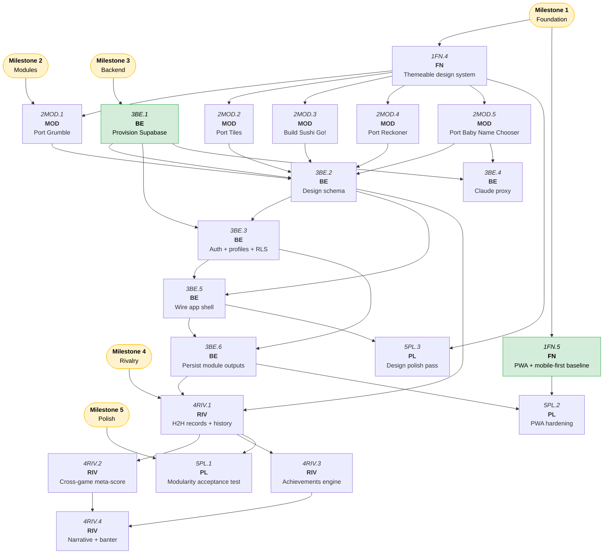

# Tallywhack Roadmap

A two-person shared app (Jason + Harriet) for game scoring and shared tools. Supabase-backed with real auth + RLS. SvelteKit/Svelte 5/Bun on Vercel. Mobile-first, single-device hot-seat play.

---

## Progress Map

---

## Milestone 1 — Foundation

> Skeleton and the module contract. No features yet, but the rules every module obeys.

### To Do

- [ ] 1FN.5. PWA + mobile-first baseline (manifest, installable, responsive shell, big touch targets) — **depends on 1FN.1**

### Completed

- [x] 1FN.4. Establish themeable design system (Reasonable Colors base, swappable tokens, shared components, module-selectable palettes) — contract widened (`winner: PlayerId | null`), shared `createLocalStore`, 6 shared components, `emerald`/`green`/`raspberry` themes shipped
- [x] 1FN.3. Build module auto-discovery + registry (filesystem-derived, category-aware) — **depends on 1FN.2**
- [x] 1FN.2. Define the module contract (manifest: id, name, category, icon, routes, theme, results-shape) — **depends on 1FN.1**
- [x] 1FN.1. Scaffold SvelteKit + Svelte 5 + Bun app (adapter-vercel) — single flat app at repo root, Reasonable Colors base, module directory skeleton

---

## Milestone 2 — Modules

> All five modules ported to the stack and working locally (no DB yet). Each conforms to the module contract.

### Blocked

- [ ] 2MOD.4. Port Reckoner (group ranking/decision tool) into the module system — **depends on 1FN.2, 1FN.3, 1FN.4**
- [ ] 2MOD.5. Port Baby Name Chooser — UI to Svelte, Claude calls moved to SvelteKit server route — **depends on 1FN.2, 1FN.3, 1FN.4**

### Completed

- [x] 2MOD.3. Build Sushi Go! scorer — full auto-scoring engine, maki ties, set bonuses, wasabi/nigiri, pudding carry-over + tiebreaker, draw detection (`winner: null`)
- [x] 2MOD.2. Port Tiles (Scrabble scorer) from single-file HTML to Svelte module — tile/quick mode, caret-preserving input, end-game rack adjustment, draw support
- [x] 2MOD.1. Port Grumble (Gin Rummy scorer) into the module system — full scoring pipeline, persistence, multi-game match tracking

---

## Milestone 3 — Backend

> Supabase schema (derived from built modules), real auth + RLS, app shell wired up, persistence live.

### To Do

- [ ] 3BE.1. Provision Supabase cloud project + local dev workflow + env/secrets wiring — **depends on 1FN.1**

### Blocked

- [ ] 3BE.2. Design schema from modules (profiles, matches, results, tool_outputs, JOIN tables for aggregation) — **depends on 2MOD.1, 2MOD.2, 2MOD.3, 2MOD.4, 2MOD.5, 3BE.1**
- [ ] 3BE.3. Implement Supabase auth (real login) + profiles + RLS policies (household scoping, 2 users) — **depends on 3BE.1, 3BE.2**
- [ ] 3BE.4. Secure Baby Name Claude proxy (server route holds key, env-managed) — **depends on 2MOD.5, 3BE.1**
- [ ] 3BE.5. Wire app shell — module launcher, navigation, category browsing, profile/identity — **depends on 3BE.3** (1FN.3 ✓)
- [ ] 3BE.6. Persist module outputs (game match history + tool outputs) to Supabase with hot-seat 2-player capture — **depends on 3BE.3, 3BE.5**

---

## Milestone 4 — Rivalry

> The emotional payoff. Cross-game meta-score, achievements, and narrative/banter.

### Blocked

- [ ] 4RIV.1. Per-game head-to-head records + match history views — **depends on 3BE.2, 3BE.6**
- [ ] 4RIV.2. Cross-game meta-score / unified Tallywhack standing (ELO or championship points across all games) — **depends on 4RIV.1**
- [ ] 4RIV.3. Achievements & milestones engine (streaks, comebacks, game-specific badges) — **depends on 4RIV.1**
- [ ] 4RIV.4. Narrative & banter layer (auto-commentary, streak alerts, "on this day", taunts) — **depends on 4RIV.2, 4RIV.3**

---

## Milestone 5 — Polish

> Prove the modularity, harden the experience, feel finished.

### Blocked

- [ ] 5PL.1. Add one new module end-to-end to validate the module contract (modularity acceptance test) — **depends on 4RIV.1**
- [ ] 5PL.2. PWA hardening — offline-tolerant scoring, install prompts, table-use ergonomics — **depends on 1FN.5, 3BE.6**
- [ ] 5PL.3. Design polish pass — per-module identity within the family, motion, empty states — **depends on 1FN.4, 3BE.5**
